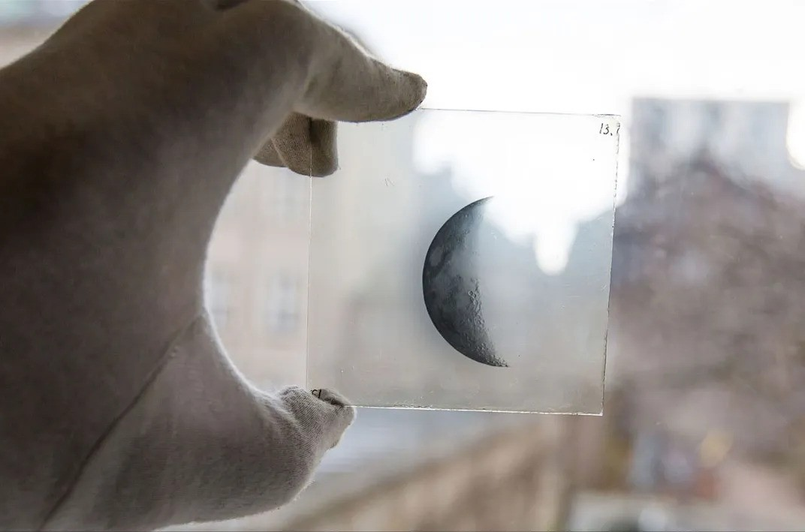

<!-- README.md is generated from README.Rmd. Please edit that file -->

```{r, include = FALSE}
knitr::opts_chunk$set(
  collapse = TRUE,
  comment = "#>",
  fig.path = "man/figures/README-",
  out.width = "100%"
)
```

# photoplate

<!-- badges: start -->
<!-- badges: end -->

The goal of photoplate is to customize stargazer::stargazer() regression tables for inclusion in LaTeX documents.

Until the later 1980s, astronomers used glass photographic plates to record their observations. These plates made it possible for them to share what they saw when gazing toward the stars; in that spirit, this package's eponymous function is named "photoplate."

```{r photographic plate, echo=FALSE, fig.cap="A collection of glass plates from 1909 to 1922 capture the moon in different phases. Niels Bohr Institute, University of Copenhagen", out.width = '100%'}

```

[source and further reading]((https://www.smithsonianmag.com/science-nature/obsolete-art-mapping-skies-glass-plates-can-still-teach-us-180971890/)


The below example illustrates the functionality of the package.


## Installation

You can install the development version of photoplate from [GitHub](https://github.com/) with:

```{r installation}
# install.packages("pak")
pak::pak("imperialnolini/photoplate")
```

## Example

This is a basic example of how to use the package:

```{r example}
library(photoplate)

# Let's estimate a linear model and reformat its stargazer LaTeX output.

# We'll estimate a model for y = b0 + b1*x1 + b2*x2 + e, where:
#  - b0 = 10
#  - b1 = -20
#  - b2 = 30
#  - e = error following a uniform distribution from 0.0001 to 1
 
# We begin by generating 10000 datapoints (let's sample with replacement
# from 0 to 10000000 for x1 and x2 and from 0 to 1 without replacement for e
# then calculate values of y per the betas defined above):
base::set.seed(1)
x1 = sample(0:10000000, 10000, TRUE)
x2 = sample(0:10000000, 10000, TRUE)
e = sample(1:10000, 10000, FALSE, rep(1/10000, 10000))/10000
y = 10 + (-20*x1) + (30*x2) + e
 
# We continue by estimating a model:
model <- lm(y ~ x1 + x2)
 
# We can feed the model to stargazer::stargazer() to look at its results:
stargazer::stargazer(model, type = "text")

# Note you should always check that form of textual output - especially
# if you use the various stargazer::stargazer() parameters to format the
# output (e.g., renaming the variables) - prior to using photoplate().

# For this example, we'll save the .tex file in your temporary directory.
# Let's get that save filepath:
save_path = tempfile(pattern = "photoplate_example",
                    fileext = ".tex",
                    tmpdir = tempdir(check = TRUE))
# This code says we want a filename that's close to "photoplate_example" and
# has ".tex" as its extension, and we want it to go in your computer's
# temporary directory.

# Having verified that model output seems fine, we feed it to photoplate()
# with arguments for the additional parameters:
photoplate(
  stargazer::stargazer(model),
  "!h",
  save_path,
  "model_output_label_for_crossref"
  )

# That code will make a .tex file with the stargazer::stargazer() output
# of the model we estimated and with "!h" as the table format argument.
# That file will save in your temporary directory with a filename like
# "photoplate_example.tex" and with "model_output_label_for_crossref"
# as its LaTeX-internal label for cross-referencing. When you run the
# function for real, you should specify the directory where you want the
# file to save and include the specific name you would like for the file.

# Running the function like this will return something like the following:
# "Saved .tex file to: **temporary directory**\photoplate_example.tex"

# To conclude, we remove that example file from your temporary directory:
file.remove(save_path)
```


## Notes about the function's parameters

* *this_stargazer*: Call of stargazer::stargazer() on regression model output(s).

* *position*: String. Position parameter for the table in LaTeX - e.g., "h", "t", "b", "p", "!", "H". Note "!h" is similar (though not necessarily identical to) "H" and using "H" is possible only if you first load the "float" package in your LaTeX document's preamble.

* *filepath*: String. Filepath on your computer where you want the final .tex file to save; include ending of "filename.tex" for the filename and file extension. For example, "path/to/folder/filename.tex" would be fine.

* *label*: String. LaTeX-internal label for the table. Can use it for cross referencing.

## Additional notes

Note this function was made with the intention to use it only for stargazer::stargazer() calls on regression models, though the stargazer::stargazer() function can do more than only format estimated models.

For the stargazer::stargazer() call in photoplate(), there is no need to specify anything for the "type" or "out" parameters, though you can use the other parameters to change the default output of the function. It is worth verifying the output looks good by generating a textual output before running photoplate().

For more information about LaTeX table position parameters, please see LaTeX's documentation.
