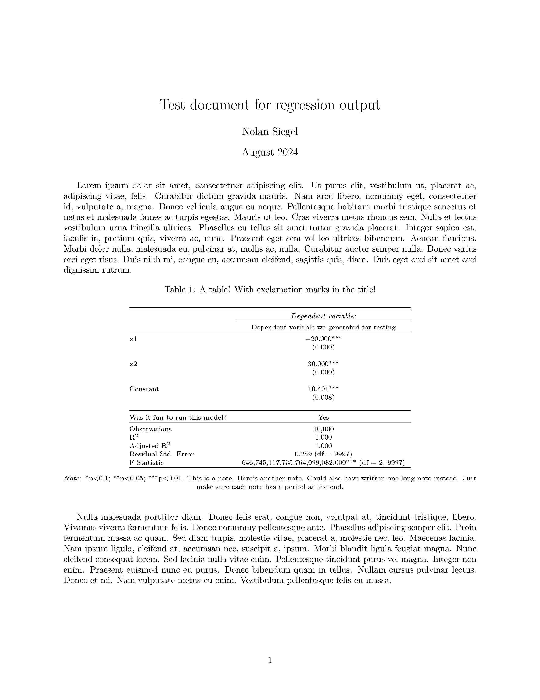

<!-- README.md is generated from README.Rmd. Please edit that file -->

```{r, include = FALSE}
knitr::opts_chunk$set(
  collapse = TRUE,
  comment = "#>",
  fig.path = "man/figures/README-",
  out.width = "100%"
)
```

# photoplate

<!-- badges: start -->
<!-- badges: end -->

The goal of photoplate is to customize stargazer::stargazer() regression tables for inclusion in LaTeX documents. The example below illustrates the functionality of the package.

Until the later 1980s, astronomers used glass photographic plates to record their observations. These plates made it possible for them to share what they saw when gazing toward the stars; in that spirit, this package's eponymous function is named "photoplate."

```{r photographic plate, echo=FALSE, fig.cap="A collection of glass plates from 1909 to 1922 capture the moon in different phases. Niels Bohr Institute, University of Copenhagen.", out.width = '75%', fig.align = 'center'}
knitr::include_graphics("auxiliaries/photographic_plate.jpeg")
```
[Image source and more information about photographic plates](https://www.smithsonianmag.com/science-nature/obsolete-art-mapping-skies-glass-plates-can-still-teach-us-180971890/)


## Installation

You can install the development version of photoplate from GitHub by running the following:

```{r installation, message = F}
# install.packages("pak")
pak::pak("imperialnolini/photoplate")
```

## Example

This is a basic example of how to use the package:

```{r load package}
library(photoplate)
```


Let's estimate a linear model and reformat its stargazer LaTeX output.

We'll estimate a model for y = b0 + b1*x1 + b2*x2 + e, where:
  * b0 = 10
  * b1 = -20
  * b2 = 30
  * e = error following a uniform distribution from 0.0001 to 1
 
We begin by generating 10000 datapoints (let's sample with replacement from 0 to 10000000 for x1 and x2 and from 0 to 1 without replacement for e then calculate values of y per the betas defined above):
```{r generate data}
base::set.seed(1)
x1 = sample(0:10000000, 10000, TRUE)
x2 = sample(0:10000000, 10000, TRUE)
e = sample(1:10000, 10000, FALSE, rep(1/10000, 10000))/10000
y = 10 + (-20*x1) + (30*x2) + e
```

We continue by estimating a model:
```{r estimate model}
model <- lm(y ~ x1 + x2)
```

We can feed the model to stargazer::stargazer() to look at its results:
```{r review results}
stargazer::stargazer(model,
                     title = "A table! With exclamation marks in the title!",
                     dep.var.labels = "Dependent variable we generated for testing",
                     add.lines = list(c("Was it fun to run this model?", "Yes")),
                     notes = c("This is a note.",
                               "Here's another note.",
                               "Could also have written one long note instead.",
                               "Just make sure each note has a period at the end."),
                     table.layout = "m=!ldc#-!t-!a-!s=!n",
                     type = "text")
```

Note you should always check that form of textual output - especially if you use the various stargazer::stargazer() parameters to format the output (e.g., renaming things and/or adding notes, as done here) - prior to using photoplate().

Having verified the model output seems fine by looking at that textual output, it's time to run photoplate() for real. This time, however, we won't pass in arguments for the "type" or "out" keyword parameters.

**Note any call to the function makes a .tex file (1) with the stargazer::stargazer() LaTeX-formatted output from the first argument minus the argument for a textual output (2) and with the position parameter as whatever you pass in as the second argument (3) in a file saved at the filepath given as the third argument (4) with the LaTeX-internal label of what you enter for the fourth argument (for cross-referencing purposes). The function call will also return the save filepath.**

Let's run it:
```{r function call}
photoplate(
  this_stargazer = stargazer::stargazer(
    model,
    title = "A table! With exclamation marks in the title!",
    dep.var.labels = "Dependent variable we generated for testing",
    add.lines = list(c("Was it fun to run this model?", "Yes")),
    notes = c("This is a note.",
              "Here's another note.",
              "Could also have written one long note instead.",
              "Just make sure each note has a period at the end."),
    table.layout = "m=!ldc#-!t-!a-!s=!n"),
  position = "!h",
  filepath = "auxiliaries/example_output.tex",
  label = "model_output_label_for_crossref"
  )
```

All done! Let's look at the LaTeX file (created with [this](auxiliaries/latex_file.tex) code then converted into a JPEG):

# ```{r latex pdf, echo=FALSE, out.width = '75%', fig.align = 'center'}
# 
# ```


## Notes about the function's parameters

* *this_stargazer*: Call of stargazer::stargazer() on regression model output(s). DO NOT enter arguments for the keyword parameters "type" and "out" (though technically it's ok to have values for them which would yield a latex output, but it's probably easier to leave them out entirely).

* *position*: String. Position parameter for the table in LaTeX - e.g., "h", "t", "b", "p", "!", "H". Note "!h" is similar (though not necessarily identical to) "H" and using "H" is possible only if you first load the "float" package in your LaTeX document's preamble.

* *filepath*: String. Filepath on your computer where you want the final .tex file to save; include ending of "filename.tex" for the filename and file extension. For example, "path/to/folder/filename.tex" would be fine.

* *label*: String. LaTeX-internal label for the table. Can use it for cross referencing.

## Additional notes

Note this function was made with the intention to use it only for stargazer::stargazer() calls on regression models, though the stargazer::stargazer() function can do more than only format estimated models.

For the stargazer::stargazer() call in photoplate(), there is no need to specify anything for the "type" or "out" parameters, though you can use the other parameters to change the default output of the function. It is worth verifying the output looks good by generating a textual output before running photoplate().

For more information about LaTeX table position parameters, please see LaTeX's documentation.
