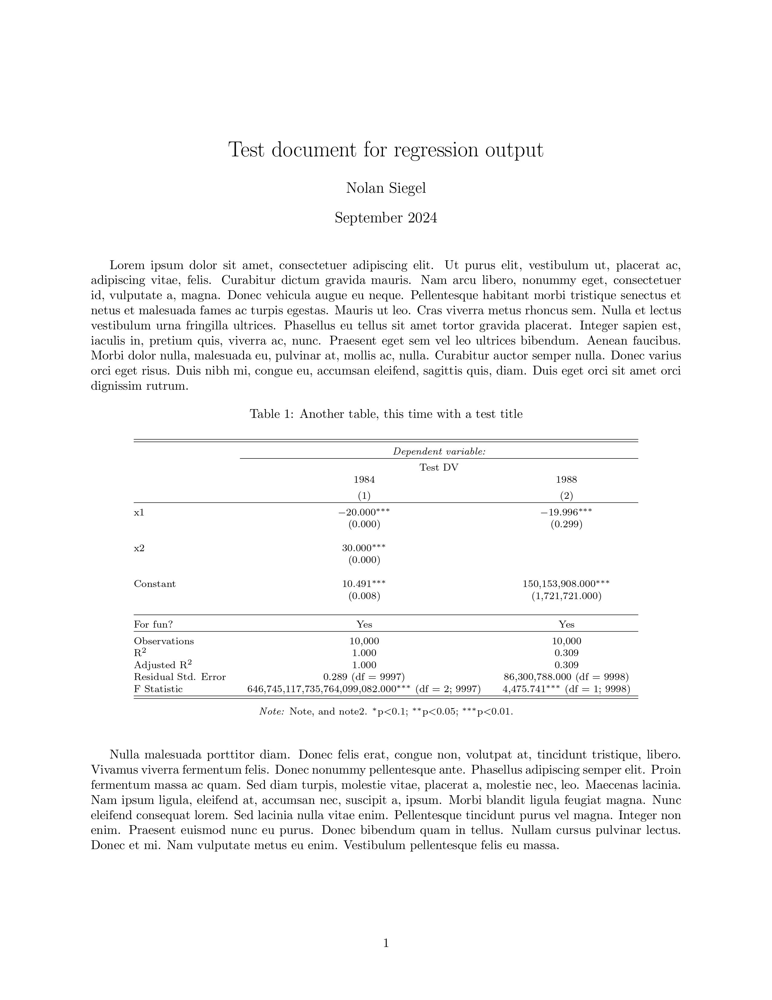

<!-- README.md is generated from README.Rmd. Please edit that file -->

```{r, include = FALSE}
knitr::opts_chunk$set(
  collapse = TRUE,
  comment = "#>",
  fig.path = "man/figures/README-",
  out.width = "100%"
)
```

# photoplate

<!-- badges: start -->
<!-- badges: end -->

The goal of photoplate is to customize stargazer::stargazer() regression tables for inclusion in LaTeX documents. The example below illustrates the functionality of the package.

Until the later 1980s, astronomers used glass photographic plates to record their observations. These plates made it possible for them to share what they saw when gazing toward the stars; in that spirit, this package's eponymous function is named "photoplate."

```{r photographic plate, echo=FALSE, fig.cap="A collection of glass plates from 1909 to 1922 capture the moon in different phases. Niels Bohr Institute, University of Copenhagen.", out.width = '75%', fig.align = 'center'}
knitr::include_graphics("auxiliaries/photographic_plate.jpeg")
```
[Image source and more information about photographic plates](https://www.smithsonianmag.com/science-nature/obsolete-art-mapping-skies-glass-plates-can-still-teach-us-180971890/)


## Installation

You can (probably) install the development version of photoplate from GitHub by running the following:

```{r first pass installation, message = F}
# install.packages("pak")
pak::pak("imperialnolini/photoplate")
```

If that doesn't work, there's one more option we can try. Note you may be prompted to update a few packages as we try this (that should be fine to do), and you may get some warning messages at the end. If you do, despite them, try loading the package with "library(photoplate)" to see if the package was successfully installed. Here's the code to install it:

```{r second pass at installation, message = F}
# install.packages("devtools")
devtools::install_github("imperialnolini/photoplate")
```


## Example

What follows is a walkthrough of how to use the package. We begin by loading it:

```{r load package}
library(photoplate)
```


Let's estimate a linear model and reformat its stargazer LaTeX output.

We'll estimate a model for y = b0 + b1\*x1 + b2\*x2 + e, where:

  * b0 = 10
  
  * b1 = -20
  
  * b2 = 30
  
  * e = error following a uniform distribution from 0.0001 to 1
  
 
We'll generate 10000 datapoints for our analysis. Let's sample with replacement from 0 to 10000000 for x1 and x2, our two explanatory variables, and from 0.0001 to 1 without replacement for e, our error. Then, we'll couple those three variables with the betas identified above to calculate our y, dependent variable. The data generation:
```{r generate data}
base::set.seed(1)
x1 = sample(0:10000000, 10000, TRUE)
x2 = sample(0:10000000, 10000, TRUE)
e = sample(1:10000, 10000, FALSE, rep(1/10000, 10000))/10000
y = 10 + (-20*x1) + (30*x2) + e
```

We continue by estimating a model for y as a function of x1 and x2:
```{r estimate model}
model <- lm(y ~ x1 + x2)
```

We can feed the model to stargazer::stargazer() to look at its results:
```{r review results}
stargazer::stargazer(model,
                     title = "A table! With exclamation marks in the title!",
                     dep.var.labels = "Dependent variable we generated for testing",
                     add.lines = list(c("Was it fun to run this model?", "Yes")),
                     notes = c("This is a note ending in a period.",
                               "Here's another note.",
                               "Could also have written one long note instead.",
                               "About to end a note with --, and-- right here:, and",
                               "just so I can pick up that sentence on a new line.",
                               "We see there isn't a new period after the --and-- from that line.",
                               "Ending lines in other ways may add an extra period at the end."),
                     table.layout = "m=!ldc#-!t-!a-!s=!n",
                     type = "text")
```

Prior to using photoplate::photoplate(), it's a good idea to check that form of textual output - especially if you use the various stargazer::stargazer() parameters to format the output (e.g., renaming things and/or adding notes, as done here).

Having looked at that textual output and verified the stargazer::stargazer() call seems fine, it's time to run photoplate() for real. This time, however, we won't pass in arguments for the "type" or "out" keyword parameters.

In general, the photoplate::photoplate() function seems to work best when "stargazer_call = "  is NOT included in its function call, so best to leave that out and simply enter the stargazer::stargazer() call as the first parameter without explicitly identifying it as such. Also, you may get an extra period in your comment if you end a line in something other than a period or --, and-- in the case of splitting a compound sentence across separate elements in the notes() parameter of stargazer::stargazer(). Also note the usual comment of the keys for stars re: p-value significance levels will be at the end of the comment. Future versions of this package may make an option to suppress that line in case you don't want to include the default p-values and their corresponding significance stars in your output (e.g., if you'd prefer to include standard errors with no stars instead).

**Note any call to the function makes a .tex file with edits to the the regular stargazer::stargazer() LaTeX-formatted output, and the function call will return the filepath where it saved the .tex file.**

Let's run it:
```{r function call}
photoplate(
  stargazer::stargazer(
    model,
    title = "A table! With exclamation marks in the title!",
    dep.var.labels = "Dependent variable we generated for testing",
    add.lines = list(c("Was it fun to run this model?", "Yes")),
    notes = c("This is a note ending in a period.",
              "Here's another note.",
              "Could also have written one long note instead.",
              "About to end a note with --, and-- right here:, and",
              "just so I can pick up that sentence on a new line.",
              "We see there isn't a new period after the --and-- from that line.",
              "Ending lines in other ways may add an extra period at the end."),
    table.layout = "m=!ldc#-!t-!a-!s=!n"),
  position = "!h",
  label = "model_output_label_for_crossref",
  filepath = "auxiliaries/example_output.tex"
  )
```

All done! Let's look at the LaTeX rendering of the photoplate() LaTeX table we made (see [here](auxiliaries/latex_file.tex) for the .tex file used to create this document and [here](auxiliaries/latex_file.pdf) for the PDF of it):

```{r latex pdf, echo=FALSE, out.width = '75%', fig.align = 'center'}

```


## Notes about the function's parameters

* *stargazer_call*: Call of stargazer::stargazer() on regression model output(s). DO NOT enter arguments for the keyword parameters "type" and "out" (though technically it's ok to have values for them which would yield a latex output, but it's probably easier to leave them out entirely).

* *position*: String. Position parameter for the table in LaTeX - e.g., "h", "t", "b", "p", "!", "H"; for more information, please see LaTeX's documentation. Note that "!h" is similar (though not necessarily identical) to "H" and that using "H" is possible only if you first load the "float" package in your LaTeX document's preamble.

* *label*: String. LaTeX-internal label for the table. Can use it for cross referencing (e.g., with the hyperref package).

* *filepath*: String. Filepath on your computer where you want the final .tex file to save; include ending of "filename.tex" for the filename and file extension. For example, "path/to/folder/filename.tex" would be fine.


## Wrapping up

This function was made with the intention to use it only for stargazer::stargazer() calls on regression models, though the stargazer::stargazer() function can do more than only format estimated models.

For the stargazer::stargazer() call in photoplate(), there is no need to specify anything for the "type" or "out" parameters, though you can use the other parameters to change the default output of the function. It is worth verifying the output looks good by generating a textual output before running photoplate().

Finally, if you encounter any issues using the package, please feel free to email me at nolan.s.siegel@gmail.com; I'll look forward to improving anything that might be helpful. Thank you.
